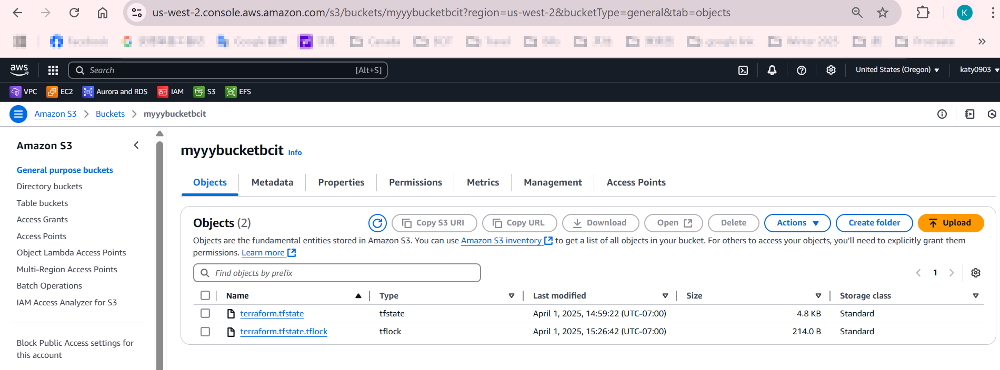

# 4640-w13-lab-start-w25

See D2L for lab instructions

1. When is the state file created?

The state file is created after you run terraform apply for the first time. It stores the current infrastructure stat.

2. When is the lock file present?

The lock file appears temporarily during terraform plan and terraform apply to prevent other processes from modifying the state at the same time.

3. Is the lock file always in the bucket after it is created?

No, the lock file is removed automatically after the Terraform operation (e.g., plan or apply) completes.

- Take a screenshot that shows the state file only.

- Take a screenshot that shows the lock file and the state file.
